# Automatic classification of consumer goods from text and images

## Problem

The aim of this project is to **automate the task of assigning an item's category, based on a photo
and description** of the item for sale, submitted by a seller to an e-commerce marketplace.

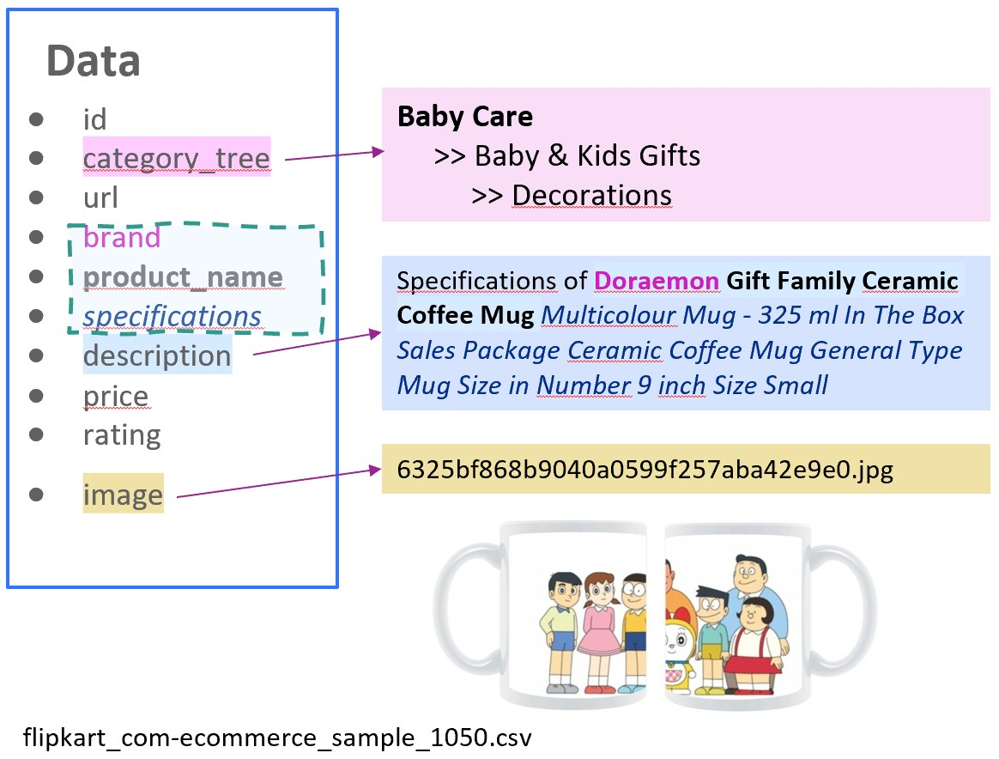

The volume of items is currently very small, and _**an item's category is assigned manually by the
sellers, and is therefore unreliable**_.

The automation of this task is necessary:

- To improve the user experience of sellers (facilitate the posting of new articles)
- To improve the user experience of buyers (facilitate the search for products)
- To scale up to millions of items.

## Motivation

This is project 6 for the **Master in Data Science** (in French, BAC+5) from OpenClassrooms.

The project demonstrates the feasibility of automatically grouping same category products:

- **pre-processing** product descriptions and images
- **extraction of features**, from the processed data or its embedding within a model
- **dimension reduction** techniques
- **clustering**, confirmed by similarity between real categories and clusters.
- **visualization** of clusters of products

## Requirements

To run the notebooks, the dataset must be placed in a DATA_FOLDER ('data/raw'). Python libraries are
listed in `requirements.txt`. Each notebook also includes a list of its own requirements, and a
procedure for `pip install` of any missing libraries.

**Data**: A first dataset (~330Mb) of 1050 articles with photo and an associated description:
[the link to download](https://s3-eu-west-1.amazonaws.com/static.oc-static.com/prod/courses/files/Parcours_data_scientist/Projet+-+Textimage+DAS+V2/Dataset+projet+pre%CC%81traitement+textes+images.zip)

**Python libraries** :

- `numpy, pandas, matplotlib, seaborn, scikit-learn, tensorflow, yellowbrick`
- text :`nltk, gensim, transformers, tensorflow_hub, tensorflow_text, wordcloud`
- images : `pillow, opencv-contrib-python, tensorflow, plotly, kaleido, pydot, graphviz`

## Files

_Notes_ : Files are in French. _As requested for the project, the jupyter notebooks have not been
"cleaned up" : the focus is the practice of techniques for pre-processing, setting up, tuning,
visualising and evaluating text/image machine learning and deep learning algorithms_.

_Custom functions created in this project for data pre-processing, statistical analysis and data
visualization are encapsulated within each notebook, to avoid importing and versioning custom
libraries. Open https://nbviewer.org/ and paste notebook GitHub url if GitHub takes too long to
render._

- [P6_01_text_nlp.ipynb](./P6_01_text_nlp.ipynb): Text classification techniques.
  
- [P6_02_image_classification.ipynb](./P6_03_image_classification.ipynb): Image classification, plus
  classification when combined with text features.
  

- [P6_03_support.pdf](./P6_03_support.pdf): Presentation and conclusion

---

## Summary of approaches

> _**Note : The quality of pre-processing of images and text descriptions has a huge impact on the
> performance of the models**_

Unsupervised, semi-supervised and supervised classification techniques were used for product
categorization

- based only on product text descriptions
- based only on product images`
- combining features extracted from both text and images

**Text classification (Natural Language Processing)** was undertaken using:

- Bag of Words (BoW): word count and TF-IDF vectorization, with n-grams
- Topic Modelling using Latent Dirichlet Allocation
- Word Embedding using Word2Vec pre-trained models
- Word Embedding using deep learning (contextuel skipgrams in LSTM neural networks: BERT,
  HuggingFace transformers, Universal Sentence Encoder
- Keras (supervised) word embedding: train-test split, demonstrating overfitting of the training
  data.

**Image classification (Computer Vision)** was performed:

- image feature extraction : bag of visual features (SIFT, ORB) ; Visual feature vectors
- supervised training on simple Convolution Neural Networks (CNN)
- semi-supervised on VGG16 pretrained (ImageNet - 1000 features)
- unsupervised (on VGG16 features minus 2 layers)
- supervised **transfer learning**, with **fine-tuning**
- **regularization** through the use of **image augmentation** and **dropout layers**

**Combined text and image features** were used to improve the final product categorization

| classification      | description                                                                                                                                      |
| ------------------- | ------------------------------------------------------------------------------------------------------------------------------------------------ |
| **unsupervised**    | K-means clustering after feature selection and dimension reduction, selecting the number of categories which provides the most distinct clusters |
| **semi-supervised** | the number of clusters was fixed (K=7)                                                                                                           |
| **supervised**      | the (labelled) categorised data was split into train, test and validation sets, to learn the features of each category.                          |

Supervised classification was conducted using neural network models:

- shallow neural networks were created to quickly test the impact of pre-processing of text and
  images, and regularization mechanisms
- deep neural networks were trained on the best pre-processing models

## Visualising the work undertaken:

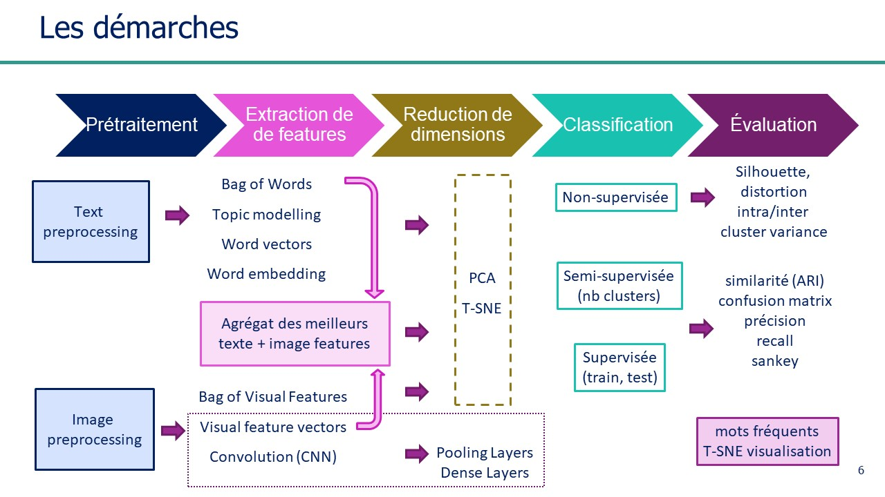

`

---

## Text classification (NLP)

### Text pre-processing

- Cleaning ("stop phrases", tokenization, stemming, stop words (identified with low IDF)
- Lemmatization (removes context, so excluded from sentence embedding models)

### Extraction of text features:

- **Bag of Words** : word **count** and **TF-IDF** vectorization (_Term Frequency–Inverse Document
  Frequency_)
  - Tuning with use of n-grams and regex patterns

### Topic Modelling : Latent Dirichlet Allocation(LDA)

To identify the most suitable category names, (semi-supervised) topic modelling was applied to the
Bag-of-Words features. The TF-IDF vectorization provided a good correlation between the discovered
topics and the existing 7 categories.

- **Topic visualization with word clouds**

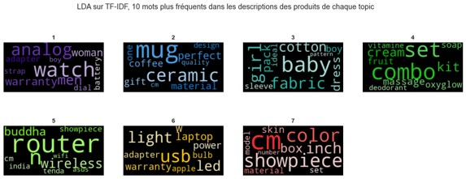

### Dimensionality Reduction using PCA and t-SNE

The extracted features (for example, word frequencies) were reduced by principal component analysis
(PCA), keeping 99% of explained variance, before applying t-distributed stochastic neighbor
embedding (t-SNE) to reduce to two dimensions.

### Optimal number of categories (unsupervised clustering using Kmeans)

K-means clustering was applied to identify the clusters, for number of clusters ranging from 4 to 12

Automatic classification works best when the categories are clearly separated.

- elbow of distortion score
- high silhouette score
- low davies-bouldin score

Unsupervised classification produced most clearly separated clusters with 7 categories.

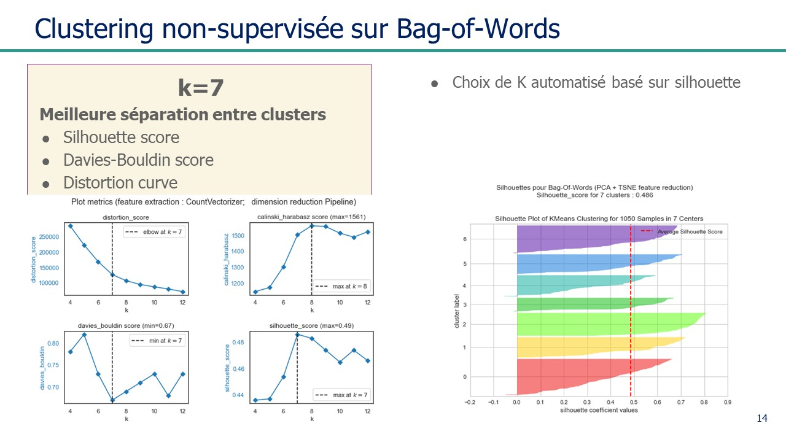

### Evaluation of semi-supervised clustering (k=7)

The performance of each model was evaluated by the multicategory confusion matrix, from which we can
calculate, for each category:

- precision
- recall
- accuracy

These can be summarised in the classification report, and visualised in a Sankey Diagram

### Adjusted Rand Index (ARI)

- measure of similarity between predicted and actual categories

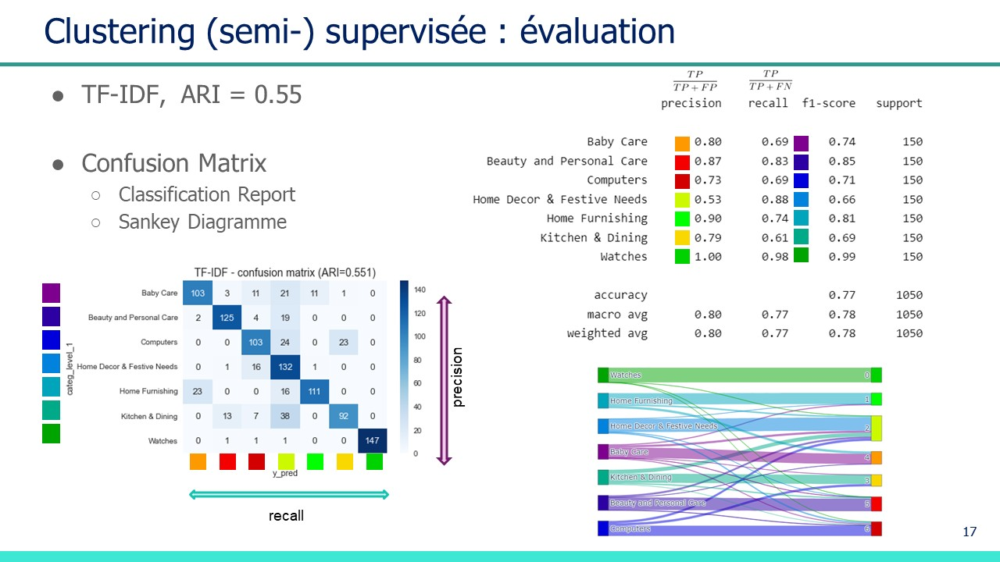

---

### Word Embedding (Word2Vec)

Word embedding using word2vec is based on skipgrams: words found close together sequentially tend to
be closely related, and so will have similar feature vectors. Clustering of word vectors (after
dimensionality reduction by PCA and TSNE) gives the following most frequent words, coloured by
cluster:

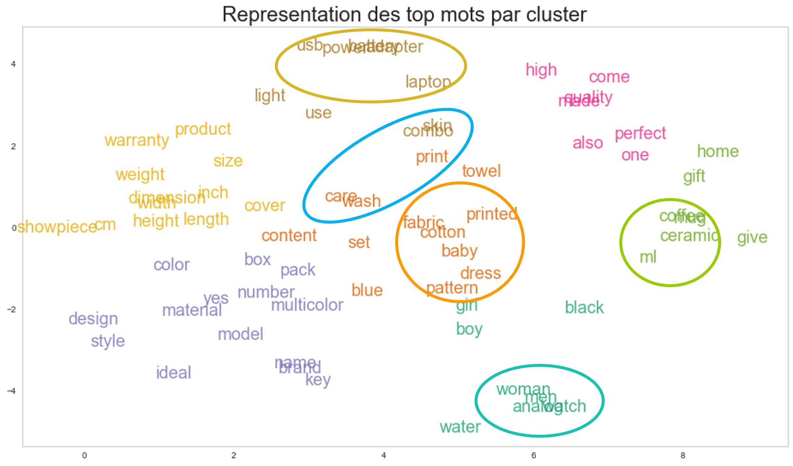

### Sentence embedding using BERT the Universal Sentence Encoder (USE)

BERT (Bidirectional Encoder Representations from Transformers) and USE models were tested supplying
unlemmatized descriptions to pretrained models.

Despite being deep learning models, and taking time to process the embedded words, the results were
less impressive than the simpler text models.

- This may be because the product descriptions are mostly not sentences, but often generated from
  key-value pairs of product characteristics. Using skipgrams, the keys such as {color, length,
  width, height, quantity,...) may add noise rather than context. By contrast, these words have
  little weight in TF-IDF vectorization.

### Supervised text classification

Tensorflow was used to test supervised classification (data split: 80% train, 20% test), improving
the results to close to 90% accuracy on the test set after 10 epochs. However, these models overfit
to the 7 categories, and are unlikely to be useful for new product categories.`

---

### Conclusion on Text classification

Based solely on text descriptions, clustering using TF_IDF categorization gave the best similarity
with the labelled categories

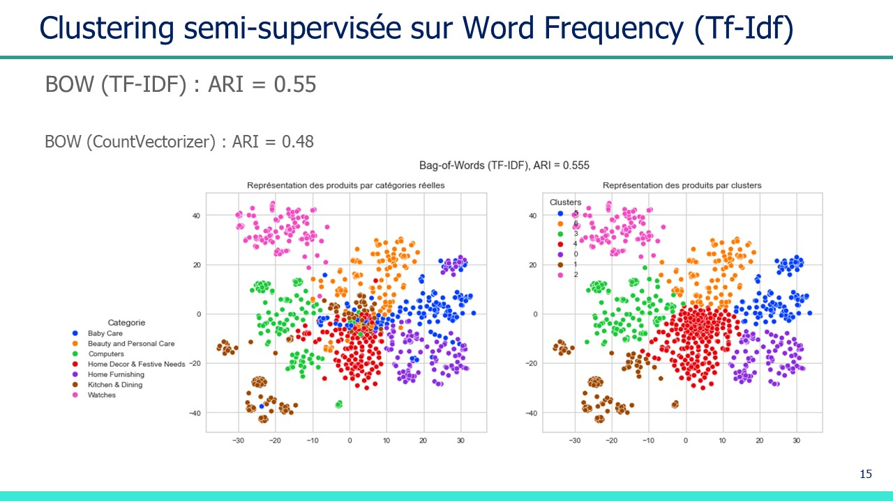

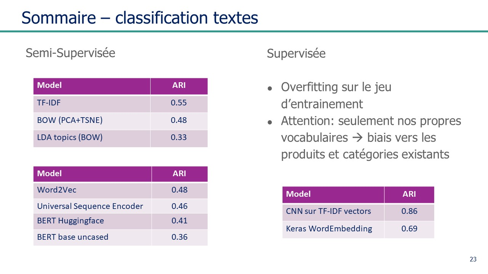

---

## Image Classification (Computer Vision)

### pre-processing of images

Images were adjusted for

- exposition
- equalization of histogram
- noise filters
- colour/greyscale
- resize
- normalization of values to between -1 and 1

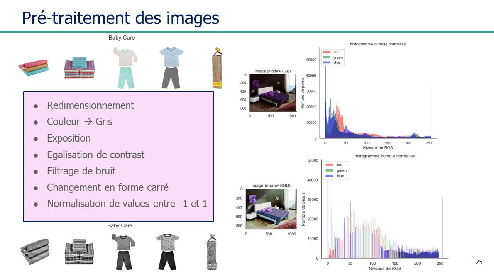

---

### Image feature extraction : bag of visual features (SIFT, ORB)

- SIFT (**S**cale-**I**nvariant **F**eature **T**ransform)
- ORB (**O**riented FAST and **R**otated **B**RIEF) Clustering of products after dimension reduction
  via PCA/t-SNE was not very clear

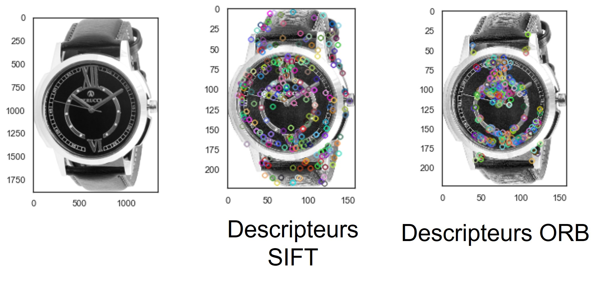

---

### Convolution Neural Networks for Image feature extraction

A simple convolution neural network composed of 2 convolution layers (with maxpooling), a dropout
layer for regularization, a flattening layer and 2 dense layers was used to quickly test
pre-processing pipelines, and evaluate the effect of regularization (~1 million parameters, training
times of a few seconds).

For this particular problem, better results were obtained from CNN deep learning models, pretrained
on millions of images

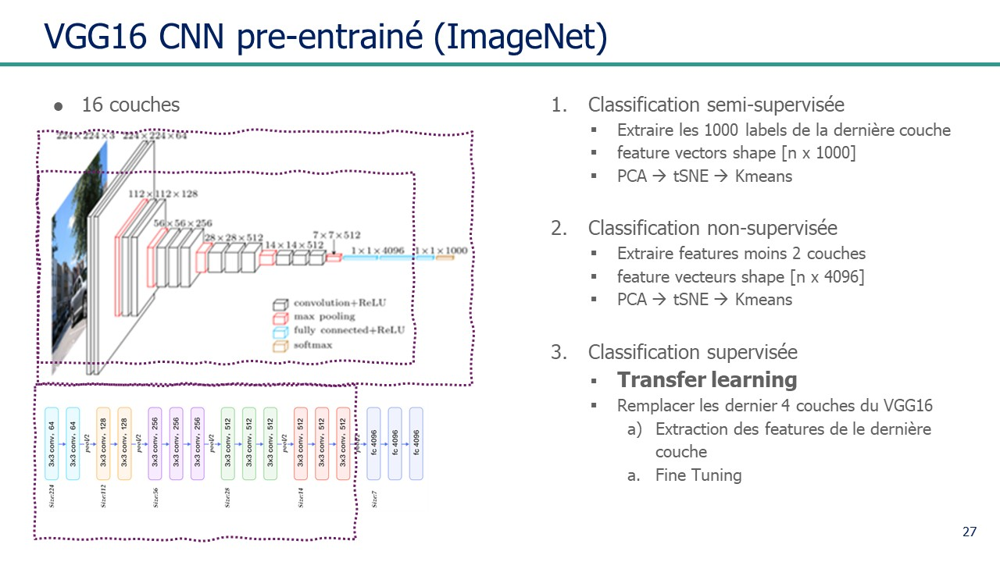

The deep learning convolution neural network
[VGG-16 model](https://www.tensorflow.org/api_docs/python/tf/keras/applications/vgg16/VGG16) (2014)
was used in this project. However, it can
[easily be replaced](https://www.analyticsvidhya.com/blog/2020/08/top-4-pre-trained-models-for-image-classification-with-python-code/)
by other models such as
[ResNet](https://www.tensorflow.org/api_docs/python/tf/keras/applications/resnet_v2) (2015),
[Inception-V3](https://www.tensorflow.org/api_docs/python/tf/keras/applications/inception_v3)
(2015), or
[EfficientNet](https://www.tensorflow.org/api_docs/python/tf/keras/applications/efficientnet_v2)
(2019) for example.

TensorFlow provides these deep learning models, pre-trained for 1000 categories using the
[ImageNet](https://en.wikipedia.org/wiki/ImageNet) dataset (14 million labelled images).

---

### Semi-supervised classification using CNN pre-trained deep learning model

The VGG-16 pretrained model (ImageNet weights) was used to detect the probability of each image
belonging to a given category. These 1000 features were reduced in dimension by PCA followed by
t-SNE, using the same procedures as for text classification. The result was an **ARI score of
0.38**, corresponding to an accuracy of around 60%

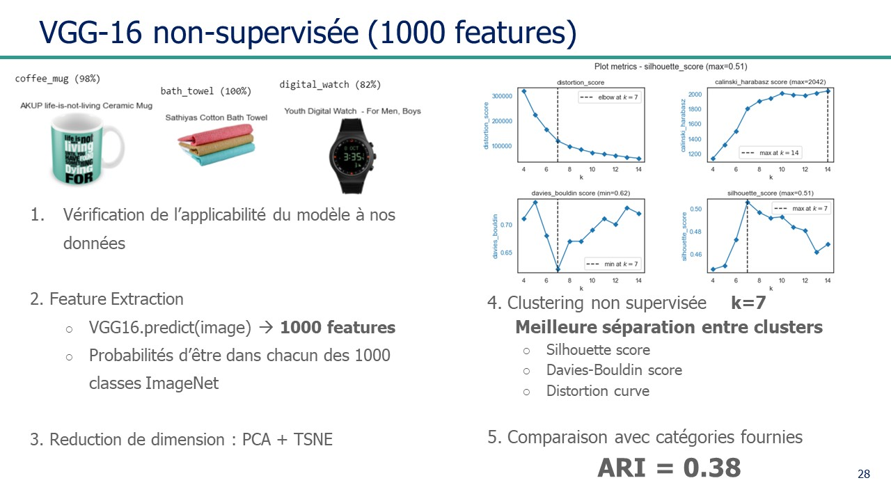

### Unsupervised classification using CNN pre-trained deep learning model

To improve classification, the last two layers were removed, leaving 4096 underlying features
instead of the 1000 categories. Applying dimension reduction and K-means clustering resulted in an
**ARI score of 0.53**, equivalent to an accuracy of around 70%

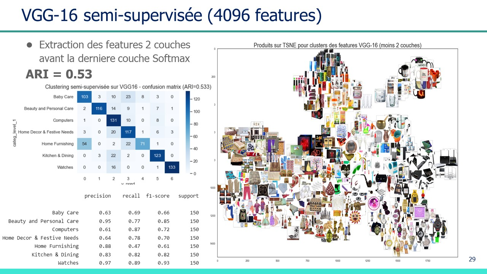

### Simple supervised classification

- a simple convolution network was trained on the images.
- overfitting was observed, so image augmentation and a dropout layer were added

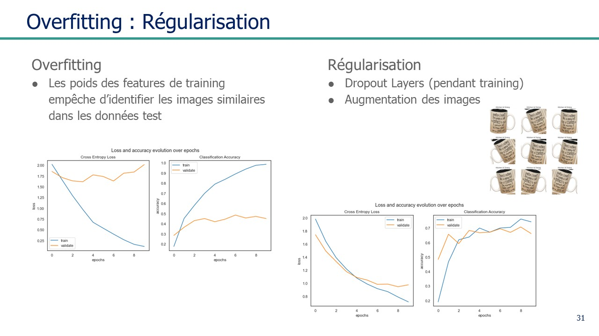

### Transfer Learning (supervised classification)

- the dense layers were removed and replaced with a flattening layer and new dense layers, along
  with a final softmax function to choose between the 7 categories.
- the convolution layers were kept and their pre-trained weights were _frozen_ to avoid losing the
  pretrained image features
- fine tuning was applied by adjusting only the weights in the new dense and softmax layers, whilst
  freezing the pre-trained weights in the convolutional layer
- _categorical crossentropy_ was used as the **loss function**
- the **Adam optimization algorithm** was used to for fast optimization (an extension to stochastic
  gradient descent)

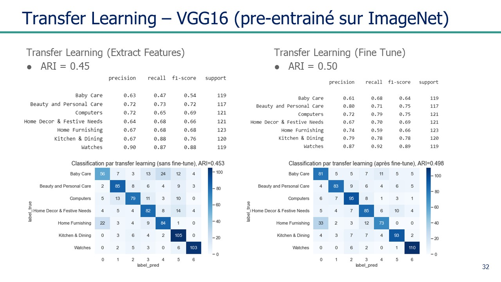

### Summary of image classification results

- feature extraction using SIFT and ORB were not very successful
- unsupervised classification using features after removing the last 2 layers of VGG-16 gave the
  best results for classification based soley on the images

| type             | model                                                        | ARI score |
| ---------------- | ------------------------------------------------------------ | --------- |
| semi-supervised  | SIFT                                                         | 0.05      |
| semi-supervised  | ORB                                                          | 0.04      |
| unsupervised     | VGG-16 pretrained (1000 features)                            | 0.38      |
| **unsupervised** | **VGG-16 pretrained, last 2 layers removed (4096 features)** | **0.53**  |
| supervised       | Transfer Learning                                            | 0.45      |
| supervised       | Transfer Learning after fine tuning                          | 0.50      |

---

## Text and Image features combined for unsupervised classification

The best results were obtained by combining the best text features with the best image features,
resulting in an **accuracy of 84%**

- This can probaly be improved using more recent deep learning model for word embedding and image
  transfer learning.

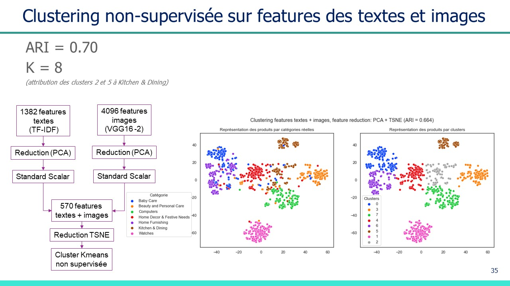

## Conclusion

The images are visualised on the t-SNE axes for the final model (text **and** image features
combined):

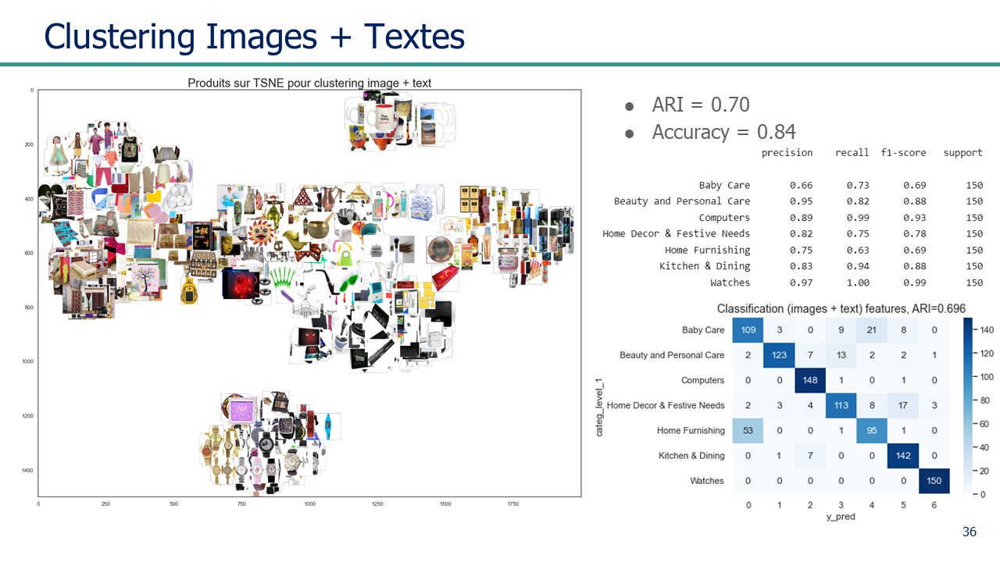

---

## Possible Improvements

- Remove as much noise as possible in the text descriptions (example: stop phrases) and in the
  images (equalization and noise filters) :
  - _**pre-processing has a major impact on the performance**_
- Replace VGG-16 with recent (pre-trained) deep learning models are faster, more efficient, more
  accurate
- Try out different dense layer and regularization mechanisms
- adjust trhe learning rate during fine-tuning
- Add the text features extracted by TF-IDF as inputs to the deep learning model, alongside the
  image features extracted by convolution layers, before fine-tuning the weights of the final dense
  layers and the softmax layer.
- Alternatively, fine tune a Keras word embedding model, then extract the features from one of the
  final layers as input to the image dense layers

## Features (keywords)

**text classification, natural language processing (NLP)**

- text pre-processing : stop phrases, tokenization, stopword, lemmatization
- text feature extraction : bag of words (Count, TF-IDF vectorization, n-grams, regex patterns)
- topic modelling : LDA – Latent Dirichlet Allocation
- topic visualization : wordClouds
- word vectors : Word2Vec, skip-grams
- word embedding : contextual skip-grams, deep learning, LSTM neural networks, BERT, 
  HuggingFace transformers, Universal Sentence Encoder
- Keras word embedding train-test split, overfitting, variance-bias, regularization, validation set

**image classification, computer vision (CV)**

- image pre-processing : resize, colour/greyscale, exposition, equalization, noise filters,
  squarify, normalization
- image feature extraction : bag of visual features (SIFT, ORB), visual feature vectors
- convolution neural networks (CNN) : VGG16 pretrained (ImageNet) – semi-supervised (1000 features)
- unsupervised (features minus 2 layers)
- supervised image classification : transfer learning, fine-tuning,
- deep learning : pooling layers, dense layers, activation layers (reLu, softmax)
- regularization : image augmentation, dropout layers

**dimensionality reduction**

- PCA, t-SNE

**K-means clustering**

- silhouette score, distortion, intra/inter cluster variance,
- cluster similarity, adjusted rand index (ARI), multiclass confusion matrix,
- precision, recall, f1-score, classification report, sankey diagrams

## Skills acquired

- Preprocess text data to obtain a usable dataset for Natural Language Processing
- Unsupervised text classification and topic modelling techniques
- Preprocess image data to obtain a usable dataset for Computer Vision
- Implement dimension reduction techniques
- Represent large-scale data graphically
